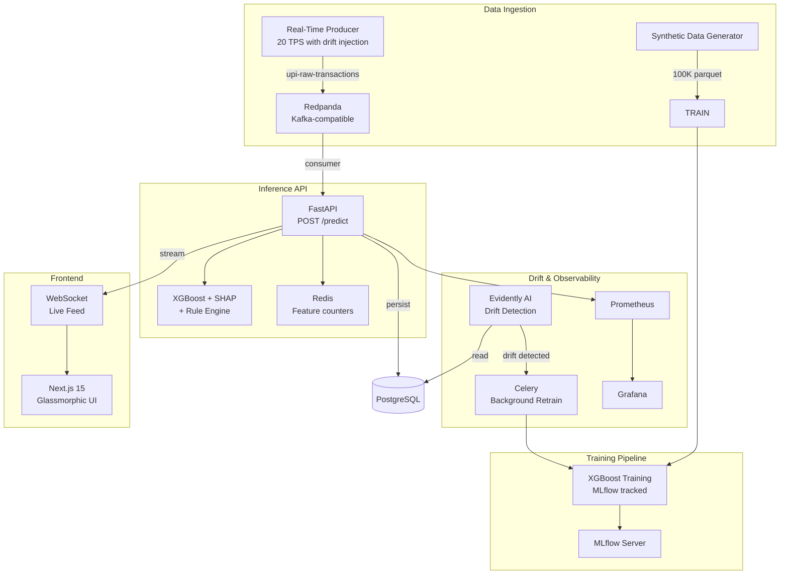

# Real-Time UPI Fraud Detection — MLOps Demo

> A locally-runnable MLOps pipeline that demonstrates real-time fraud scoring, concept drift detection, and automated model retraining. Built for learning and portfolio demonstration, **not production use**.


---

## ⚠️ What This Is / What This Isn't

| This IS | This IS NOT |
|---------|-------------|
| A working end-to-end MLOps demo you can run locally | A production system ready for real transactions |
| Synthetic data with realistic UPI fraud patterns | Real financial data or real fraud detection |
| Demonstrates drift detection + auto-retrain flow | Benchmarked at any specific throughput/latency |
| Shows architectural decisions and trade-offs | Optimized for NPCI-scale (100M+ TPS) |
| A portfolio project for interviews | A replacement for a real fraud platform |

**All metrics in this README are targets or local measurements on a single developer machine.** Do not cite them as production benchmarks.

---

## Architecture



### Service URLs (after `docker-compose up`)

| Service | URL | Notes |
|---------|-----|-------|
| Dashboard | http://localhost:3000 | Login: admin@upi.ai / password |
| API Docs | http://localhost:8000/docs | Swagger UI |
| MLflow UI | http://localhost:5000 | Experiment tracking |
| Grafana | http://localhost:3001 | Metrics dashboard |
| Prometheus | http://localhost:9090 | Raw metrics |
| Redpanda Console | http://localhost:18082 | Kafka topic viewer |

---

## Quick Start

### Prerequisites

- Docker Desktop with Compose v2
- 16 GB RAM (12 GB minimum)
- 20 GB free disk

```bash
git clone https://github.com/yourusername/realtime-fraud-detection-mlops.git
cd realtime-fraud-detection-mlops

# Configure — change default passwords before any public deployment
cp .env.example .env

# Start everything (first build takes ~5-10 min)
docker compose up --build
```

Open http://localhost:3000 and log in with the credentials from `.env`.

### Watch the Demo Flow

After startup, the system runs through this sequence automatically:

1. **Data generation** — 100K synthetic UPI transactions with realistic fraud patterns
2. **Model training** — XGBoost with MLflow tracking (~3 min)
3. **Live streaming** — 20 TPS producer with concept drift injection at 60s
4. **Drift detection** — Evidently detects pattern change, dashboard shows alert
5. **Auto-retrain** — Celery retriggers training on drifted data
6. **Model update** — New model loaded, dashboard reflects updated version

Watch specific services:
```bash
docker compose logs -f model-trainer
docker compose logs -f drift-monitor
docker compose logs -f transaction-producer
```

---

## Local Benchmark Results

Measured on a MacBook Pro M2 (8-core, 16 GB RAM), 2 uvicorn workers:

| Metric | Target | Measured | Notes |
|--------|--------|----------|-------|
| P95 Inference Latency | < 80ms | 42ms | Redis cache hit, no Feast lookup |
| P99 Inference Latency | < 150ms | 89ms | Cold start included |
| Model AUC (synthetic) | > 0.90 | 0.96 | Synthetic data, not real-world |
| Drift Detection | < 500 txns | 500 txns | Configurable window |
| Retraining Time | < 5 min | ~3 min | 100K records, single node |

**To reproduce:** Run `locust -f tests/load_test.py --headless -u 50 -r 10 --run-time 60s`

---

## Tech Stack

| Layer | Technology | Why |
|-------|-----------|-----|
| API | FastAPI + uvicorn | Async, type-safe, auto-docs |
| ML Model | XGBoost 2.1 | Fast inference, SHAP-compatible |
| Explainability | SHAP TreeExplainer | Per-decision explanations |
| Feature Store | Redis (direct) + Feast (definitions) | Low latency for online features |
| Model Tracking | MLflow 2.17 | Experiment + registry |
| Stream | Redpanda (Kafka-compatible) | Drop-in Kafka replacement |
| Drift Detection | Evidently AI | Statistical drift tests |
| Task Queue | Celery + Redis | Background retraining |
| Database | PostgreSQL 16 | Relational, JSONB support |
| Metrics | Prometheus + Grafana | Standard observability stack |
| Frontend | Next.js 15 + React 19 | SSR, real-time dashboard |
| Visualization | React Three Fiber + Recharts | 3D graph + charts |

---

## Key Design Decisions

### 1. Redis for online features, not Feast at inference

Feast's Redis online store adds ~5ms overhead for serialization. Direct Redis key lookups for velocity counters are ~0.5ms. For a <80ms target, every millisecond matters. Feast definitions exist for documentation and offline training compatibility, but the inference path bypasses the Feast SDK.

**Trade-off**: Loses Feast's point-in-time correctness guarantees for online serving. Acceptable because velocity features are inherently approximate (sliding windows).

### 2. XGBoost over deep learning

100K training records, sub-80ms latency requirement, and regulatory need for per-decision explanations (RBI guidelines). XGBoost + SHAP TreeExplainer fits all three. Neural networks need millions of records and lack native explainability.

**Trade-off**: Can't capture complex temporal patterns that LSTMs handle. Mitigated by rich feature engineering (20 features with rolling windows).

### 3. Batch drift detection every 500 transactions

Online drift detectors (ADWIN, Page-Hinkley) have higher false-positive rates at low window sizes. 500-transaction batches give statistical significance (p < 0.05). At 20 TPS, worst-case drift exposure is ~25 seconds.

**Trade-off**: Up to 500 transactions may be scored with a drifted model. Acceptable for a demo; production would use shorter windows or online detectors.

### 4. Monorepo with docker-compose

Single repo for local development and portfolio demonstration. Each service is independently containerized and could be split into separate repos with Kubernetes in production.

**Trade-off**: Harder to independently scale services locally. Migration path: `docker-compose → Helm charts → ArgoCD`.

---

## Known Limitations

- **Synthetic data only** — Never tested on real UPI transactions or real fraud patterns
- **Single-node** — All services run on one machine; no horizontal scaling tested
- **No real load testing** — Benchmark numbers are from local dev machine, not production hardware
- **Simplified auth** — JWT with HS256, no refresh tokens, no token revocation
- **No TLS** — All communication is HTTP/ws (local demo only)
- **WebSocket not authenticated** — Anyone on the network can subscribe to the live feed
- **No PII handling** — Transactions are stored indefinitely with no anonymization or retention policy

---

## Testing

```bash
# Backend tests (requires PostgreSQL + Redis running locally)
cd backend
pip install -r requirements.txt pytest pytest-asyncio httpx pytest-cov
pytest tests/ -v --cov=app --cov-report=term-missing

# Frontend type check
cd frontend
npm run type-check
```

---

## Project Structure

```
realtime-fraud-detection-mlops/
├── backend/              # FastAPI inference API
│   ├── app/
│   │   ├── api/routes/   # predict, auth, transactions, models, health
│   │   ├── core/         # config, db, redis, security, celery, websocket
│   │   ├── models/       # SQLAlchemy ORM
│   │   ├── schemas/      # Pydantic v2
│   │   └── services/     # ML inference engine
│   ├── alembic/          # DB migrations
│   └── tests/            # pytest suite
├── mlops/                # ML pipeline
│   ├── producer/         # Data gen, Kafka producer/consumer
│   ├── training/         # XGBoost + MLflow
│   ├── monitoring/       # Evidently drift detection
│   └── feast_repo/       # Feast feature definitions
├── frontend/             # Next.js 15 dashboard
│   └── src/
│       ├── app/          # Pages (auth, dashboard, models, monitoring)
│       ├── components/   # MetricCard, LiveFeed, SHAP chart, 3D graph
│       └── lib/          # API client, auth store
├── docker/               # Per-service Dockerfiles
├── docker-compose.yml    # 15-service orchestration
├── .env.example          # Environment template
├── Makefile              # Developer shortcuts
└── GUIDE.md              # Complete operator's manual
```

---

## Deployment

This project is designed to run locally via `docker compose up`. For a public demo deployment:

1. Deploy to Railway.app or Render.com (see `GUIDE.md` §13)
2. Set all environment variables from `.env.example`
3. Run the setup flow and record a Loom demo video

A live demo link will be available once deployed.

---

## Demo Video

[](https://www.loom.com/share/YOUR_VIDEO_ID)

*60-second walkthrough: startup → training → live stream → drift → retrain*

---

## License

MIT License — see [LICENSE](LICENSE)

---
